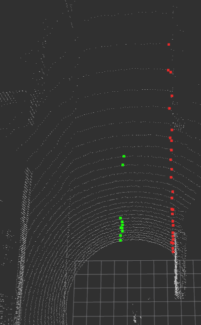

# **curb_detection**: An algorithm for road side detection based on relative gradient value filtering

 
<br>
   

# Dependency

- [ROS](http://wiki.ros.org/ROS/Installation) (tested with Melodic)
- [PCL](https://pointclouds.org/)

# Install

Use the following commands to download and compile the package.

```
cd ~/[your_ws]/src
git clone https://github.com/dobaybalazs/curb_detection.git
catkin build curb_detection
```

# Getting started

In a new terminal start roscore with the following command:
```
roscore
```
In the [Launch file](launchdir/curb_detection.launch), change the following params according to your sensor settings:
```XML
<param name="input_topic" type="string" value="/os_cloud_node/points" />
<param name="point_number" type="int" value="2048" />
<param name="channel_number" type="int" value="128" />
<param name="frame_id" type="string" value="/base_link" />
```
<br>
Then start the program in a separate terminal:

```
roslaunch curb_detection curb_detection.launch
```
A tab will pop up after that,that contains all the parameters with their default values, which looks like this:
<br>


| Params      | Description | 
| ----------- | ----------- |
| useBoxFilter      | Should a box-filter be used       |
| max_x   | Maximal X value        |
| min_x   | Minimal X value       |
| max_y   | Maximal Y value       |
| min_y   | Minimal Y value       |
| max_z   | Maximal Z value        |
| min_z   | Minimal Z value       |
| min_rad   | Minimal distance from the vehicle        |
| filter_a   | Should filtering based on ambient gradient values be used       |
| mult_a   | Ambient gradient value multiplier        |
| max_a   | Maximum ambient threshold        |
| min_a   | Minimum ambient threshold        |
| filter_i   | Should filtering based on intensity gradient values be used       |
| mult_i   | Intensity gradient value multiplier        |
| max_i   | Maximum intensity threshold        |
| min_i   | Minimum intensity threshold        |
| filter_ra   | Should filtering based on range gradient values be used       |
| mult_ra   | Range gradient value multiplier        |
| max_ra   | Maximum range threshold        |
| min_ra   | Minimum range threshold        |
| filter_re   | Should filtering based on reflectivity gradient values be used        |
| mult_re   | Reflectivity gradient value multiplier        |
| max_re   | Maximum reflectivity threshold        |
| min_re   | Minimum reflectivity threshold        |
| filter_z   |Should filtering based on Z gradient values be used        |
| mult_z   | Z gradient value multiplier        |
| max_zd   |    Maximum Z threshold        |
| min_zd   |    Minimum Z threshold        |
| filter_angle   | Should filtering based on angle gradient values be used        |
| mult_angle   | Angle gradient value multiplier        |
| angle_wd_size  | Sliding window size        |
| max_angle   | Maximum angle threshold        |
| min_angle   | Minimum angle threshold        |
| filter_dist   | Should filtering based on distance gradient values be used        |
| mult_dist   | Distance gradient value multiplier        |
| dist_wd_size  | Sliding window size        |
| max_dist   | Maximum distance threshold        |
| min_dist   | Minimum distance threshold        |
| filter_ransac   | Should RANSAC be used        |
| ransac_dist  | RANSAC distance threshold        |
| rradius_min   | RANSAC minimum radius threshold        |
| rradius_max   | RANSAC maximum radius threshold        |